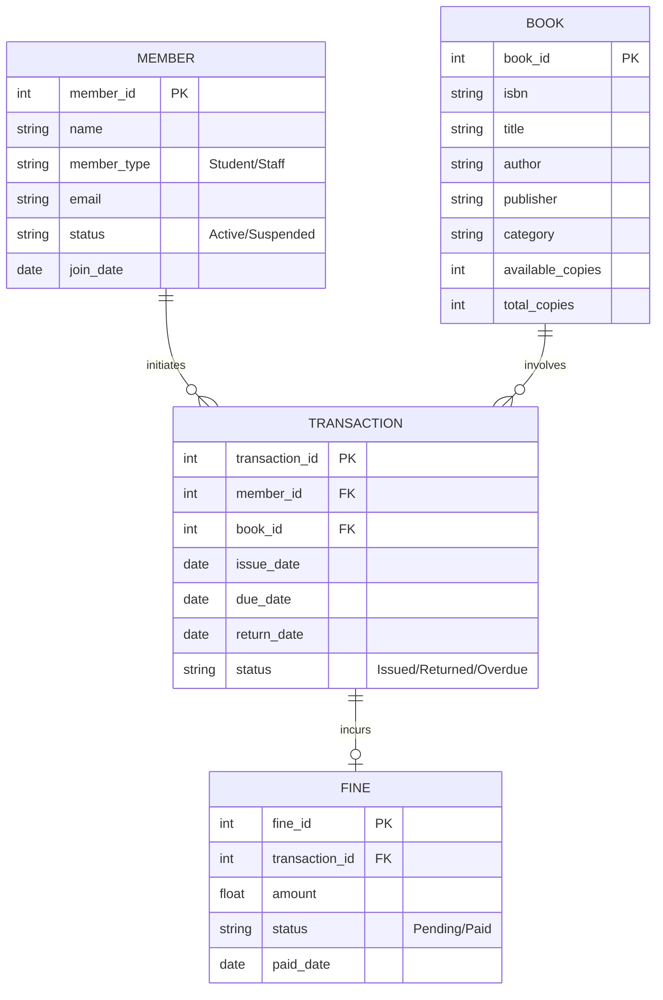
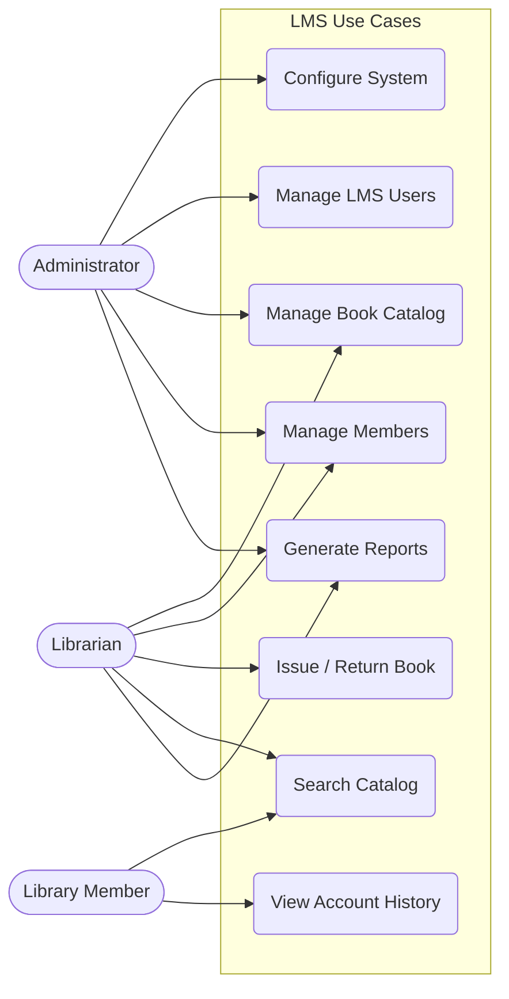
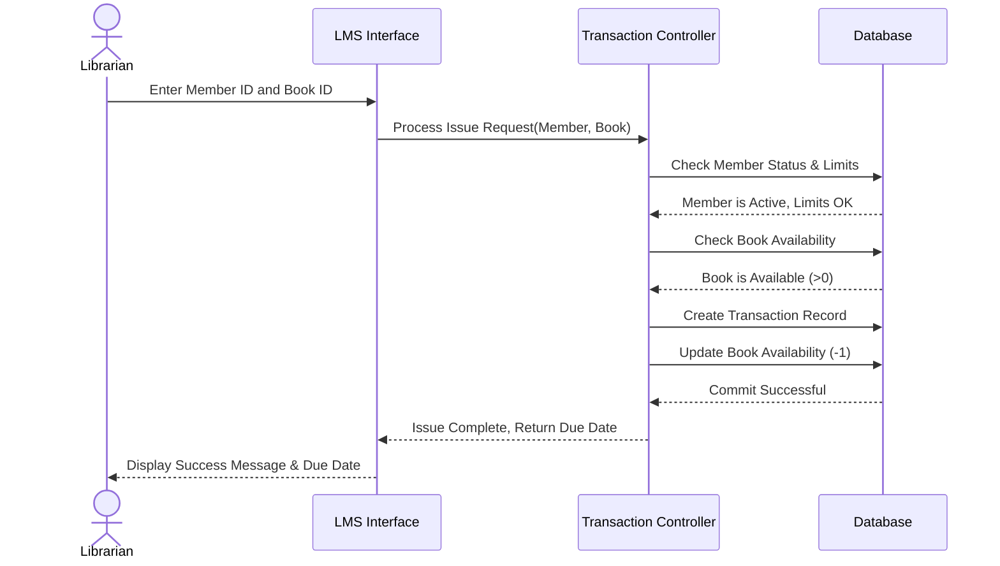

# Library Maintenance System (LMS) - System Design Document

## 1. Functional Requirements

### 1.1 Book Management
*   **Add/Update/Delete:** Maintain the library catalog by adding new books, updating existing records, or removing damaged/lost inventory.
*   **Search & Retrieval:** Fast searching using Title, Author, ISBN, Publisher, or Category.
*   **Inventory Tracking:** Real-time visibility into total copies, available copies, and accession details.

### 1.2 Member Management
*   **Registration:** Register new members (Students, Staff, Faculty) and assign unique Member IDs.
*   **Profile Management:** Update contact information, track member type, and manage membership status (Active, Suspended, Expired).
*   **History Tracking:** Full visibility into current borrowed books and past borrowing history.

### 1.3 Transaction Management
*   **Issue & Return:** Smooth checkout and check-in processes using Member ID and Book ID/Barcode.
*   **Renewal & Reservation:** Allow members to renew books (if no pending reservations) and reserve currently checked-out books.
*   **Fine Calculation:** Automated calculation of overdue fines based on the return date and library policies.

### 1.4 Reporting
*   **Inventory Reports:** List of all books, categorized by genre, author, or availability.
*   **Activity Reports:** Daily/Weekly/Monthly reports on issued and returned books.
*   **Member Reports:** Identifying top borrowers, members with overdue books, and fine collection summaries.

---

## 2. User Roles and Permissions

| Role | Privileges | Capabilities |
| :--- | :--- | :--- |
| **Administrator** | Highest | Manage system settings, configure fine rates/limits, manage user accounts (Librarians), backup/restore database, full access to all modules. |
| **Librarian** | Standard | Add/Update books and members, process book issues, returns, and renewals, collect fines, generate daily operational reports. |
| **Library Member** | Read-Only | Search for books, check book availability, view personal borrowing history and pending fines, reserve books. |

---

## 3. System Architecture

### 3.1 Database Design (Entity-Relationship)

### 3.2 Core Modules & Workflows
*   **Authentication Module:** Handles login, session management, and role verification.
*   **Catalog Module:** Handles CRUD operations on the `BOOK` table.
*   **Circulation Module:** The core workflow engine. When a book is issued, a `TRANSACTION` is created, and the `available_copies` in the `BOOK` table is decremented. When returned, `available_copies` is incremented, the `TRANSACTION` is closed, and the system checks if `return_date > due_date` to auto-generate a `FINE`.
*   **Notification Module:** SMTP worker that sends email reminders for due dates or overdue notices.

---

## 4. User Interface Design (Wireframe Concepts)

### 4.1 Login Screen
*   **Brand Header:** Library Logo and Title.
*   **Inputs:** Username/Email, Password, Role Selector Dropdown (Admin/Librarian/Member).
*   **Actions:** "Login", "Forgot Password?".

### 4.2 Dashboard (Librarian/Admin)
*   **Metrics Row (Top):** Total Books, Active Members, Books Issued Today, Total Overdue Books.
*   **Quick Actions (Sidebar):** Issue Book, Return Book, Add New Book, Add New Member.
*   **Alerts Panel:** List of recently overdue books pending action.

### 4.3 Book Management Screen
*   **Top Bar:** Search Input + "Add New Book" Button.
*   **Data Table:** Displays Book ID, Title, Author, Category, Availability Status. Include "Edit" and "Delete" icon buttons on each row.

### 4.4 Issue/Return Screen
*   **Split Layout or Tabs:**
    *   **Issue Tab:** Input fields for `Member ID` and `Book ID`. Auto-populates Member Name and Book Title on valid input. "Issue Book" button.
    *   **Return Tab:** Input field for `Book ID`. Displays original issue details, calculates late fine dynamically, and provides a "Confirm Return & Accept Fine" button.

### 4.5 Report Generation Screen
*   **Filters:** Date Range Picker, Report Type Dropdown (Inventory, Member Activity, Financial/Fines).
*   **Action:** "Generate PDF" or "Export to Excel" buttons. Preview pane directly below filters.

---

## 5. UML Diagrams

### 5.1 Use Case Diagram

### 5.2 Sequence Diagram: Issuing a Book

---

## 6. Technical Specifications

*   **Hardware Requirements:**
    *   Minimum 4 GB RAM, 2.0 GHz Dual-Core Processor.
    *   Standard desktop/laptop configurations.
    *   Optional: Barcode Scanner integration for rapid checkout.
*   **Software OS Compatibility:** Windows 10/11, macOS, or modern Linux distros (Ubuntu/Debian).
*   **Database Management System:** MySQL 8.0+ / PostgreSQL 14+ / Oracle.
*   **Communication Protocols:**
    *   **HTTP/HTTPS:** For web-based access to the system.
    *   **SMTP:** For outgoing member email alerts (overdue reminders).
    *   **SSL/TLS:** End-to-end encryption for security via HTTPS.

---

## 7. Performance & Security Requirements

### 7.1 Performance
*   **Concurrency:** Must support querying and transaction processing for 50-100 concurrent system users (staff + searching members) with API latency under 500ms.
*   **Data Integrity:** All Issue/Return operations must leverage ACID-compliant database features. DB transactions must rollback in case of partial failures (e.g., transaction record created but inventory fail to decrement).

### 7.2 Security
*   **Authentication & Authorization:** Secure login with hashed passwords (e.g., Bcrypt). Role-Based Access Control (RBAC) preventing Librarians or Members from accessing Admin-scoped endpoints.
*   **Transport Security:** Enforce HTTPS to prevent man-in-the-middle attacks, particularly when logging in or checking out books.
*   **Protection against attacks:** Parameterized queries to protect against SQL Injection; Token validation (JWT/Session) to prevent Cross-Site Request Forgery (CSRF).

---

## 8. Deployment and Maintenance

*   **Deployment Strategy (Cloud):**
    *   Host the web application using AWS (EC2/Elastic Beanstalk) or Vercel/Heroku.
    *   Use a managed database service (Amazon RDS or Supabase) to ensure automated backups and high availability.
*   **Maintenance Protocols:**
    *   **Daily:** Automated database snapshot backups during off-peak hours (e.g., 2:00 AM).
    *   **Weekly:** Application health checks, log review for error monitoring.
    *   **Monthly:** OS/dependency security patching and performance tuning.
